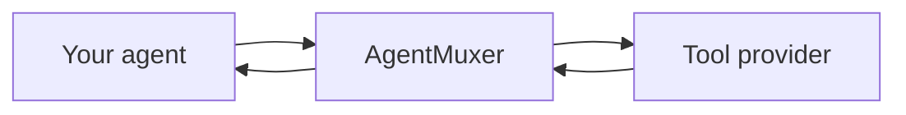

AgentMuxer connects your agent to a marketplace of capabilities, such as web search, extraction, and enrichment. Your agent finds a tool, checks its inputs and price, and calls it through AgentMuxer.

<Steps>
  <Step title="Find a capability">
    Your agent uses `search_offerings` to find relevant tools. Search is free and does not execute a tool or make a purchase.
  </Step>
  <Step title="Check the tool">
    `inspect_offering` returns the selected version's inputs, pricing, and available evidence. Your agent uses this information to prepare the request.
  </Step>
  <Step title="Use it within your budget">
    Your agent calls `call_offering` with the required inputs and a maximum price. AgentMuxer checks your balance, spending controls, and payment-confirmation setting before paid execution, then sends the request to the provider.
  </Step>
  <Step title="Review the result">
    The result returns to your agent with cost and invocation information. Your agent can report whether it helped using `report_outcome`.
  </Step>
</Steps>

## Who does what?

| You and your agent | AgentMuxer | Tool provider |
| --- | --- | --- |
| Choose the task, data to share, tool, and maximum price | Provides discovery, manages access and payment, enforces spending controls, and returns the result | Processes the selected request and supplies the capability |

Your agent makes the tool choice. AgentMuxer does not replace your model provider or route your model's inference requests.

## Understand marketplace evidence

A listing's evidence helps you decide what to try. It is not a guarantee that a tool will be available or produce the right answer for every task.

<AccordionGroup>
  <Accordion title="Benchmarked">
    The listing includes task-evaluation evidence. Read the evidence to understand what was tested and whether it matches your use case.
  </Accordion>
  <Accordion title="Verified">
    The published request schema has been fetched and validated. Schema verification alone does not establish successful paid execution or result quality.
  </Accordion>
  <Accordion title="Indexed">
    The listing was discovered in a public index and verification is pending.
  </Accordion>
</AccordionGroup>

## The protocols, briefly

AgentMuxer exposes its tools through **MCP**, which lets agent clients and frameworks discover and call them. The TypeScript SDK adapts that connection to your framework.

Provider-side payment protocols such as **MPP** and **x402** are separate from your SDK integration. Use your AgentMuxer account and application key; you do not need to implement those payment protocols to use the SDK.

<CardGroup cols={2}>
  <Card title="Build an agent" icon="code" href="/sdk/openai">
    Add AgentMuxer to an OpenAI agent.
  </Card>
  <Card title="Connect your agent" icon="plug" href="/guides/connect">
    Set up an agent you already use.
  </Card>
</CardGroup>
