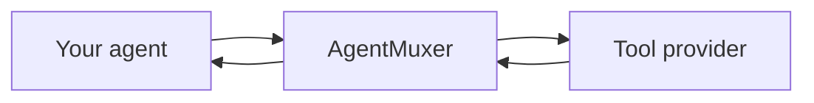

Your agent finds a tool in the marketplace, checks its inputs and price, and uses it through AgentMuxer.

<Steps>
  <Step title="Find a tool">
    Your agent searches the marketplace for a tool that fits your task. Search is free.
  </Step>
  <Step title="Check the tool">
    Your agent checks the tool's inputs, price, and available test results before using it.
  </Step>
  <Step title="Use it within your budget">
    Your agent supplies the inputs and a maximum price. AgentMuxer checks your balance, spending limits, and any required confirmation, then sends the request to the provider.
  </Step>
  <Step title="Review the result">
    Your agent receives the result and cost, and can report whether the tool helped.
  </Step>
</Steps>

## Who does what?

| You and your agent | AgentMuxer | Tool provider |
| --- | --- | --- |
| Choose the task, data to share, tool, and maximum price | Provides discovery, manages access and payment, enforces spending controls, and returns the result | Processes the selected request and supplies the capability |

Your agent chooses the tool. Your model still runs with your existing provider. For tool names and parameters, see the [MCP reference](/reference/mcp).

## What the listing badges mean

Badges show what has been checked. They help you choose a tool, but don't guarantee the result.

<AccordionGroup>
  <Accordion title="Benchmarked">
    The listing includes task-evaluation evidence. Read the evidence to understand what was tested and whether it matches your use case.
  </Accordion>
  <Accordion title="Verified">
    The tool's published input definition has been retrieved and checked. This does not mean a paid call or its results have been tested.
  </Accordion>
  <Accordion title="Indexed">
    The listing was discovered in a public index and verification is pending.
  </Accordion>
</AccordionGroup>

## MCP and payments

AgentMuxer exposes its tools through **MCP**, which lets agent clients and frameworks discover and call them. The TypeScript SDK adapts that connection to your framework.

AgentMuxer handles provider payments, including **MPP** and **x402**. You don't need to integrate either protocol yourself.

<CardGroup cols={2}>
  <Card title="Build an agent" icon="code" href="/sdk/openai">
    Add AgentMuxer to an OpenAI agent.
  </Card>
  <Card title="Connect your agent" icon="plug" href="/guides/connect">
    Set up an agent you already use.
  </Card>
</CardGroup>
